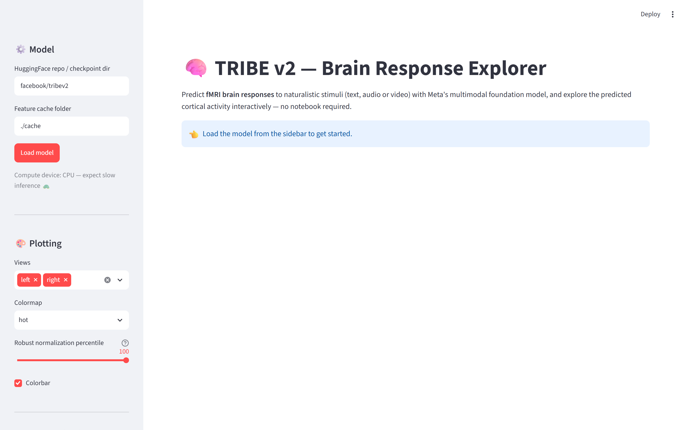
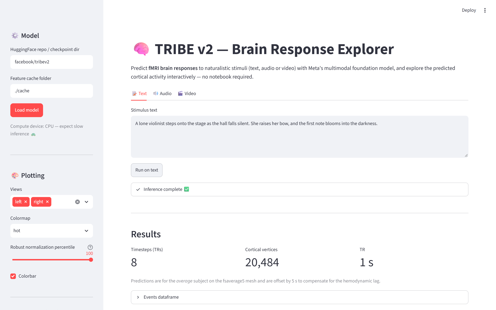
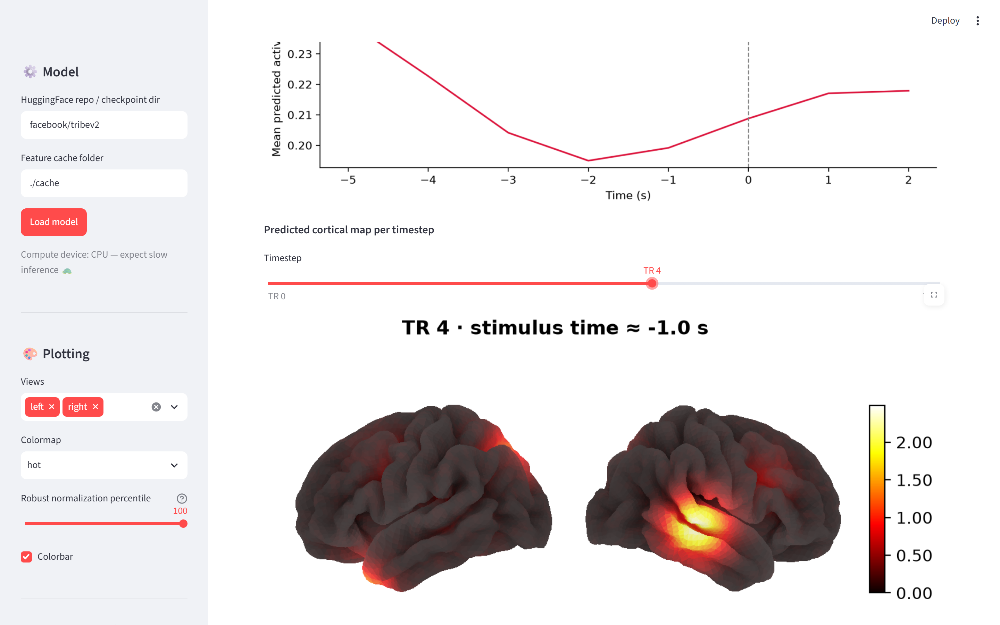
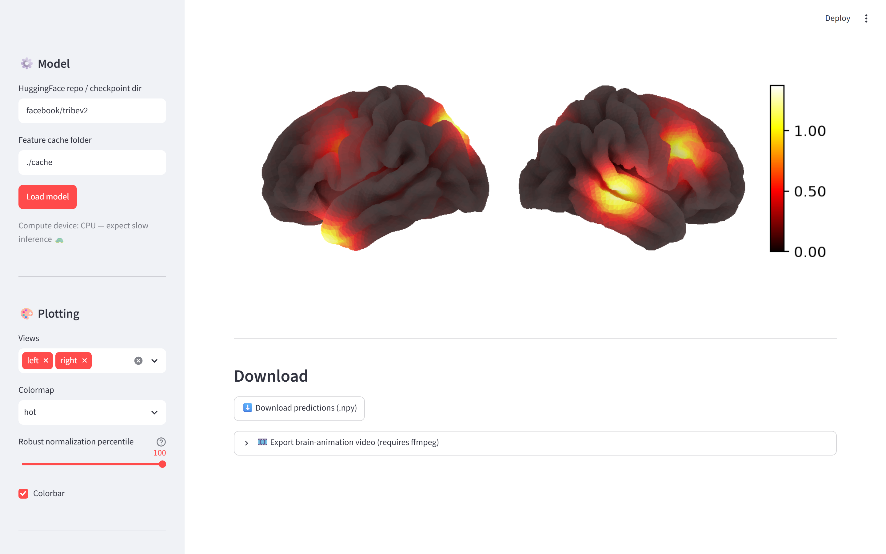

# TRIBE v2 — Interactive Web App

A [Streamlit](https://streamlit.io) web app that turns the
[`tribe_demo.ipynb`](../tribe_demo.ipynb) notebook workflow into an interactive
experience: upload a stimulus (text, audio or video), run TRIBE v2 inference,
and explore the predicted cortical activity with sliders, time-series plots and
video export — no Jupyter required.


## Features

- 📝🔊🎬 **Text, audio or video stimuli** — same `get_events_dataframe` pipeline
  as the demo notebook (text is synthesised to speech and transcribed for
  word-level timings).
- 🧠 **Interactive cortical maps** — scrub through timesteps with a slider;
  rendered headlessly with the Nilearn backend (`PlotBrainNilearn`), so it runs
  on servers without a display.
- 📈 **Global activity time series** and **mean-over-stimulus** maps.
- 🎞️ **Brain-animation export** (`.mp4`, requires `ffmpeg`).
- ⬇️ **Download raw predictions** as `.npy` (`n_timesteps × n_vertices` on the
  fsaverage5 mesh).

## Screenshots

UI walkthrough (captured on a GPU-less machine with **synthetic predictions**;
the layout and brain-surface rendering — real fsaverage5 mesh via the Nilearn
backend — are identical when running the actual model):

| Landing | Inference results |
| --- | --- |
|  |  |

| Per-timestep cortical maps (slider) | Downloads & animation export |
| --- | --- |
|  |  |

## Quick start

From the repository root:

```bash
pip install -e ".[plotting]"   # TRIBE v2 + brain-visualization deps
pip install -r webapp/requirements.txt
streamlit run webapp/streamlit_app.py
```

Then open http://localhost:8501 and click **Load model** in the sidebar.
The first run downloads the weights from
[HuggingFace](https://huggingface.co/facebook/tribev2).

> **Hardware note:** a GPU is strongly recommended. CPU inference works but is
> slow, and the feature-extraction cache can take several GB of disk.

## Deployment

- **HuggingFace Spaces:** create a *Streamlit* Space, point it at this repo and
  set the app file to `webapp/streamlit_app.py`. Add `ffmpeg` via a
  `packages.txt` if you want video export.
- **Streamlit Community Cloud / any VM:** run the Quick start commands above;
  Streamlit serves the app on port 8501 behind your reverse proxy of choice.

## How it works

The app is a thin UI layer over the public inference API — it does not modify
any model code:

```python
from tribev2 import TribeModel
from tribev2.plotting import PlotBrainNilearn

model = TribeModel.from_pretrained("facebook/tribev2", cache_folder="./cache")
events = model.get_events_dataframe(video_path="clip.mp4")
preds, segments = model.predict(events)        # (n_timesteps, n_vertices)

plotter = PlotBrainNilearn(mesh="fsaverage5")  # headless matplotlib backend
plotter.plot_surf(preds[0], views=["left", "right"], colorbar=True)
```

Predictions are for the *average* subject on the **fsaverage5** cortical mesh
(~20k vertices) and are offset by 5 s in the past to compensate for the
hemodynamic lag (see the main [README](../README.md) and
[paper](https://arxiv.org/abs/2605.04326)).

## License

Same as the parent repository: CC BY-NC 4.0. The web UI inherits the
non-commercial restriction of the TRIBE v2 weights and code.
